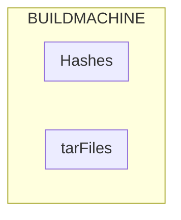

To test graphs in github

<!--
     subgraph b[Hash Signing Server]
        direction LR
            subgraph b1[Generate Hashes]
                direction TB
                 b11[Process Tar Files] -- > b12[/Hashes Files/]
            end
            subgraph Crontab
                direction TB 
                RunJob -- > b2[Create Signatures]
                b2 -- > b3[/Signature Files/]
            end 
            b1 -- > Crontab
            
     end               

     a -- > b
-->
