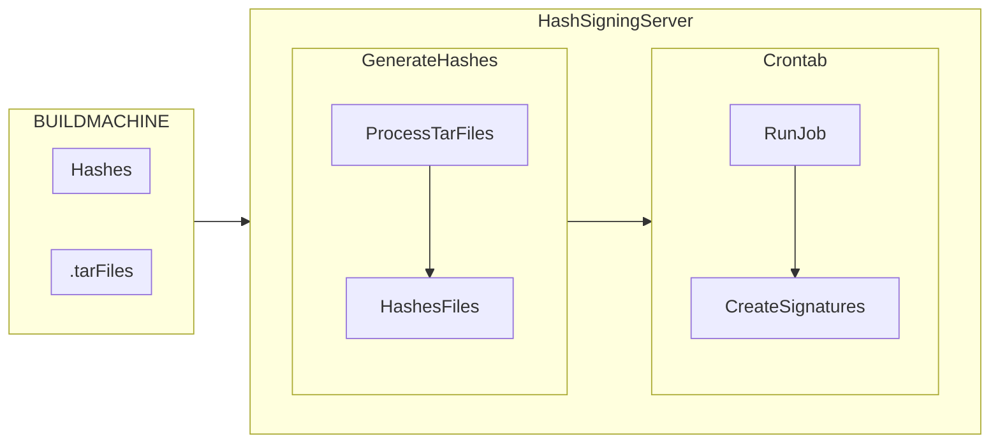

To test graphs in github

```mermaid
flowchart LR
    subgraph BUILDMACHINE
        direction LR
        subgraph .tarFiles
        end
        subgraph Hashes
        end
     end

     subgraph HashSigningServer
        direction LR
            subgraph GenerateHashes
                direction TB
                 ProcessTarFiles --> HashesFiles
            end
            subgraph Crontab
                direction TB 
                RunJob --> CreateSignatures
            end 
            GenerateHashes --> Crontab
     end               

     BUILDMACHINE --> HashSigningServer

```
